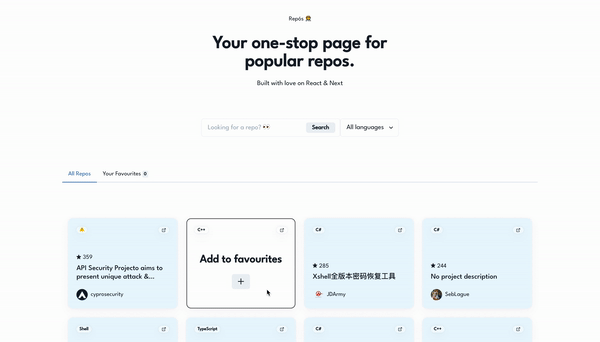

<br />

# RepꙨꙨs 🧑‍🚀
RepꙨꙨs is a simple app which fetches recent trendy repos and displays them in a user friendly-manner. Built with typescript/react components, next.js, scss and much love.

# URL


# Project Structure
    .
    ├── ...
    ├── components      # Filter, Repo, Hero and Seo (HOC) components
    ├── pages           # home route (index)
    ├── public          # favicon
    ├── redux           # state, slice, state management for repo response
    ├── utils           # Simple reusable helper functions
    ├── styles          # Contains all global styles
    ├── package.json    # Contains all dependencies
    └── ...


bootstrapped with [`create-next-app`](https://github.com/vercel/next.js/tree/canary/packages/create-next-app).

## Getting Started

First, run the development server:

```bash
npm run dev
# or
yarn dev
```

Open [http://localhost:3000](http://localhost:3000) with your browser to see the result.


## Learn More

To learn more about Next.js, take a look at the following resources:

- [Next.js Documentation](https://nextjs.org/docs) - learn about Next.js features and API.
- [Learn Next.js](https://nextjs.org/learn) - an interactive Next.js tutorial.

